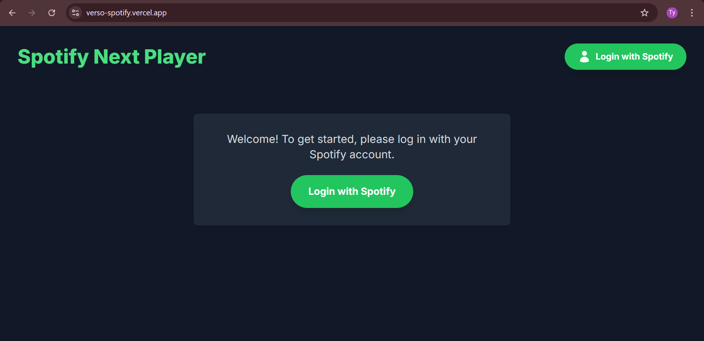
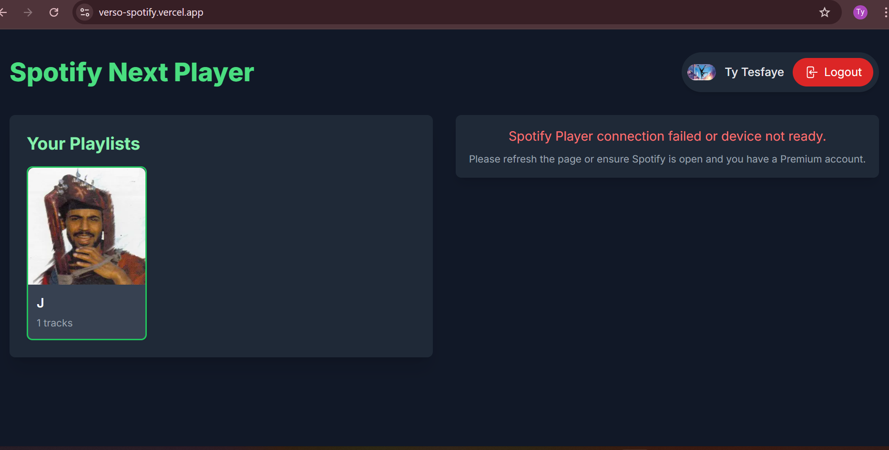

# Spotify Next.js Web Player

This is a take-home assignment implementation for a simple music player application built with Next.js, integrating with the Spotify Web API for authentication and data fetching, and the Spotify Web Playback SDK for browser-based music playback.

## Features

-   **Spotify OAuth Authentication:** Users can log in using their Spotify account.
-   **Secure Token Handling:** Access tokens are managed and refreshed using `next-auth`.
-   **User Profile Display:** Shows the authenticated user's name/email and avatar.
-   **Playlist Fetching:** Fetches and displays a list of the user's Spotify playlists (name, image, track count).
-   **Playlist Selection:** Allows users to select a playlist to view its tracks.
-   **Spotify Web Playback SDK Integration:**
    -   Initializes and connects to the Spotify Web Playback SDK.
    -   Transfers playback to the browser-based player.
    -   Displays currently playing track details (name, artist, album art).
    -   Basic playback controls: Play/Pause, Next Track, Previous Track.
    -   Displays a list of tracks from the selected playlist, allowing direct playback of any track.
-   **Error Handling:**
    -   Shows loading states for API calls and SDK initialization.
    -   Handles authentication errors, API errors, and playback errors (e.g., "Spotify Premium required").
    -   Gracefully handles session expiration by prompting re-login.
-   **Responsive Design:** Simple and responsive layout for desktop and mobile.

## Technologies Used

-   **Framework:** Next.js 14+ (with TypeScript)
-   **Authentication:** `next-auth`
-   **API Integration:** Axios (for Spotify Web API requests)
-   **Media Playback:** Spotify Web Playback SDK
-   **Styling:** Tailwind CSS
-   **Icons:** `@heroicons/react`

## Setup Instructions

Follow these steps to get the project running locally:

1.  **Clone the Repository:**
    ```bash
    git clone https://github.com/YOUR_GITHUB_USERNAME/spotify-player-app.git
    cd spotify-player-app
    ```

2.  **Install Dependencies:**
    ```bash
    npm install
    # or
    yarn add
    ```

3.  **Spotify Developer App Configuration:**
    *   Go to [https://developer.spotify.com/dashboard](https://developer.spotify.com/dashboard).
    *   Log in and create a new application.
    *   Find your **Client ID** and **Client Secret**.
    *   In your app's settings, add the following to your **Redirect URIs**:
        *   `http://localhost:3000/api/auth/callback/spotify`
        *   `http://localhost:3000` (for general redirects if needed)
    *   If you plan to deploy, also add your deployed URL, e.g., `https://your-app.vercel.app/api/auth/callback/spotify` and `https://your-app.vercel.app`.

4.  **Environment Variables:**
    *   Create a file named `.env.local` in the root of your project.
    *   Add the following variables, replacing the placeholders with your actual values:

    ```env
    SPOTIFY_CLIENT_ID=YOUR_SPOTIFY_CLIENT_ID
    SPOTIFY_CLIENT_SECRET=YOUR_SPOTIFY_CLIENT_SECRET
    NEXTAUTH_URL=http://localhost:3000
    NEXTAUTH_SECRET=YOUR_GENERATED_NEXTAUTH_SECRET
    ```
    *   **`NEXTAUTH_SECRET`**: This should be a long, random string. You can generate one using `openssl rand -base64 32` in your terminal.
    *   **Important**: Make sure `.env.local` is listed in your `.gitignore` to prevent sensitive credentials from being committed.

5.  **Run the Development Server:**
    ```bash
    npm run dev
    # or
    yarn dev
    ```

6.  **Open in Browser:**
    *   Navigate to `http://localhost:3000` in your web browser.

## Assumptions and Limitations

*   **Spotify Premium Required for Full Playback:** The Spotify Web Playback SDK requires a Spotify Premium account for full music playback in the browser. Users without a Premium account will be able to authenticate and view their playlists, but track playback functionality will be limited or unavailable (e.g., they might only hear 30-second previews or encounter "Premium required" errors).
*   **Token Refresh:** The application implements token refresh logic within `next-auth` callbacks. However, if Spotify's refresh token itself expires or becomes invalid, the user will be prompted to log in again.
*   **Simple UI:** The focus was on functionality and integration rather than a highly polished UI. Styling is basic using Tailwind CSS.
*   **Client-side Playback:** All playback occurs directly in the browser via the Spotify Web Playback SDK, meaning the browser tab must remain open for playback to continue.
*   **No Volume Control/Seek Bar:** For brevity and focusing on core requirements, advanced player features like volume control and a detailed track progress seek bar have been omitted. The SDK does provide events for progress, which could be integrated.

## Screenshots


1.  **Login Page:**
    
2.  **Authenticated - Playlists Display:**
    


## Deployment (e.g., Vercel)

This application can be easily deployed to Vercel (or similar platforms).

1.  **Connect GitHub Repository:** Link your GitHub repository to Vercel.
2.  **Environment Variables:** Ensure you configure the following environment variables in your Vercel project settings:
    *   `SPOTIFY_CLIENT_ID`
    *   `SPOTIFY_CLIENT_SECRET`
    *   `NEXTAUTH_SECRET`
    *   `NEXTAUTH_URL` (Set this to your deployed domain, e.g., `https://your-app-name.vercel.app`)
3.  **Build and Deploy:** Vercel will automatically detect it's a Next.js project and deploy it.

---
